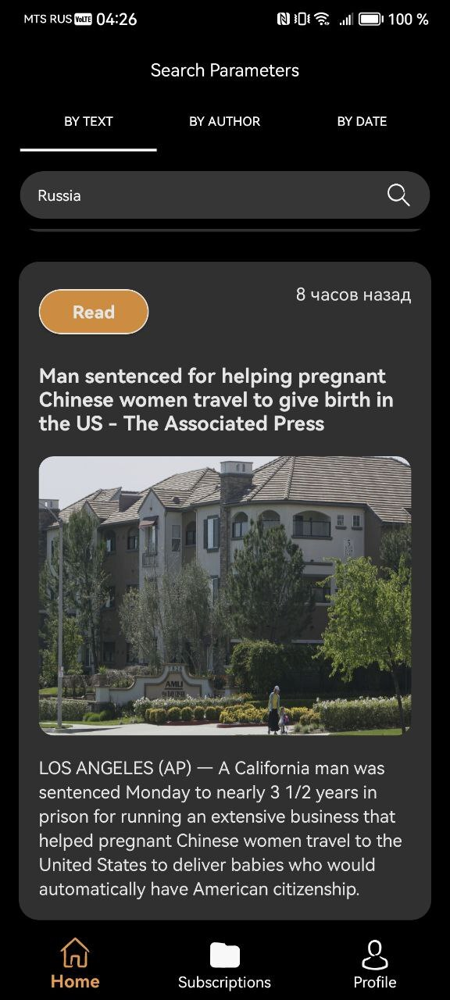
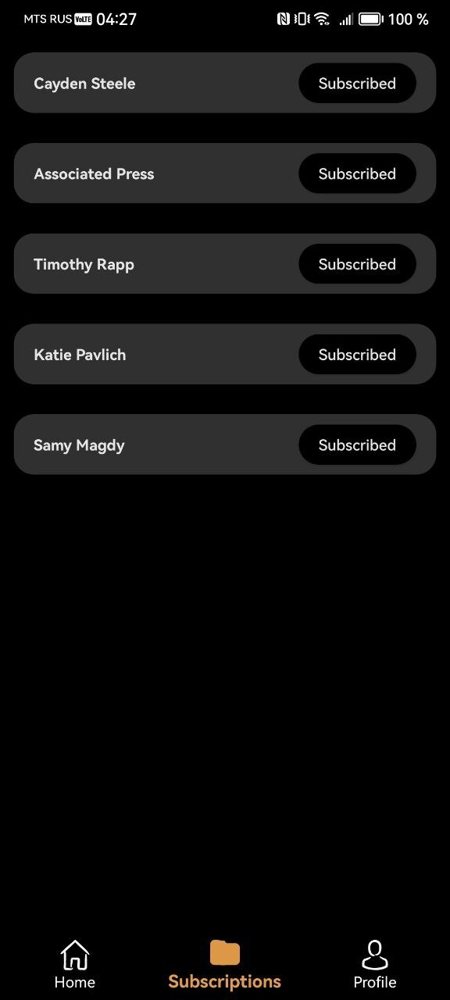
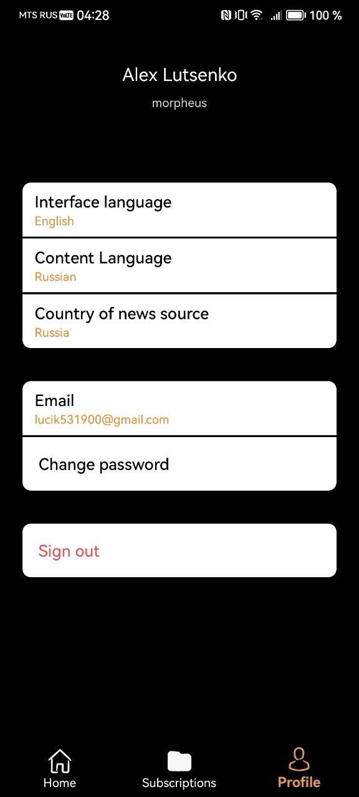
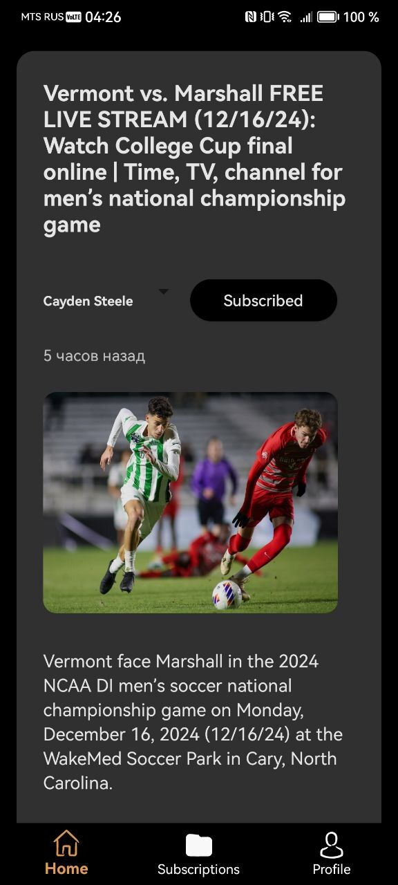
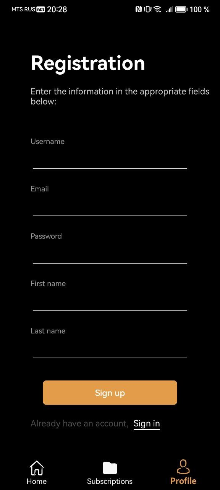
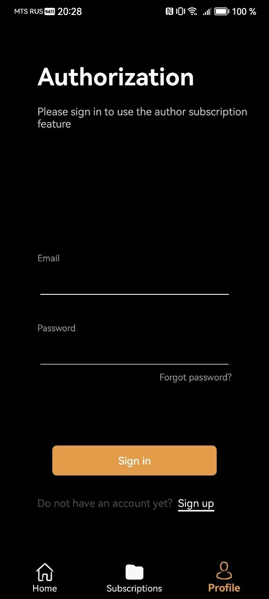
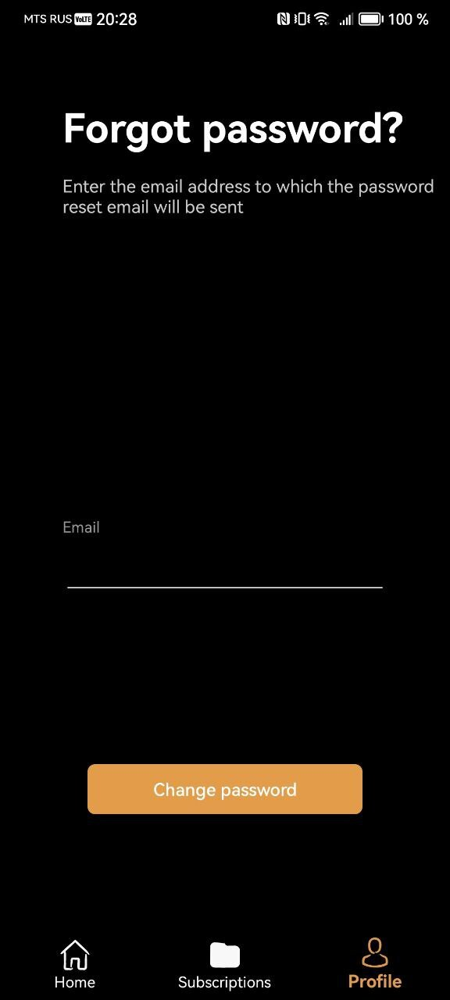

# NewsWave

Android-приложение для чтения и поиска новостей, где можно использовать фильтры, есть локальное кэширование, смена языка контента и интерфейса, а также подписки на авторов новостей.

---

## Функциональность:
- **Авторизация через Firebase**
- **Фильтрация новостей**:
  - По автору
  - По дате
  - По тексту
- **Смена языка контента и страны источника новостей**
- **Подписка на авторов**:
  - Подписки сохраняются в Firebase для каждого пользователя
  - Быстрый доступ к новостям избранных авторов
- **Локальное кэширование данных**
- **Обновление данных свайпом**
- **Смена языка интерфейса**
- **Обработка ошибок подключения и повторная загрузка**

---

## Технологии:
- **Kotlin**
- **Clean Architecture с паттерном MVVM**
- **Android Jetpack**: ViewModel, Navigation Component
- **Flow** для асинхронного программирования
- **Firebase**:
  - Firebase Auth (авторизация)
  - Firebase Realtime Database (для хранения подписок на авторов)
- **Dagger2**
- **WorkManager**
- **RecyclerView**
- **Coroutines**
- **Retrofit** (для работы с API - **https://worldnewsapi.com/**)
- **Glide** (для загрузки изображений)

---

## Архитектура
Проект реализован на основе Clean Architecture и разделен на 3 слоя:

1. Data:
  - Источники данных: сеть (Firebase, API) и локальное хранилище (RoomDatabase, DataStore).
  - Реализация репозиториев.
2. Domain:
  - Бизнес-логика приложения.
  - UseCases для обработки данных.
3. Presentation:
  - ViewModel для управления состоянием UI.
  - UI-компоненты (Fragments, RecyclerView).

---

## Запуск проекта
1. Склонируйте репозиторий:
  git clone https://github.com/alexSourceCode/NewsWave.git
2. Откройте проект в Android Studio.
3. Настройте Firebase:
  Добавьте файл google-services.json в папку app/.
4. Скомпилируйте и запустите проект на устройстве или эмуляторе.

---

## Скриншоты

### Главный экран  
  

### Экран подписок на авторов  

### Экран настроек

### Экран деталей новости  

### Экран регистрации

### Экран авторизации

### Экран сброса пароля

